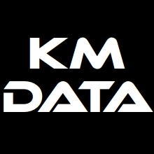

# Systemutveckling
Systemutveckling av specialprogram för tillverkningsindustri, främst fönster och dörr produktion.
Order/offert program, följesedel och fakturering, produktionsplanering, lagerstyrning och inköp mm.
Speciallösningar för order- och produktionsplanering, externa kopplingar mellan olika program och CNC-maskiner.
Låt era små tidskrävande administrativa uppgifter förenklas med små enkla program.
Genom att förenkla era arbetsuppgifter skapar ni tid till viktigare uppgifter. Det ska vara lätt att göra rätt.
[ERP-specialist](https://rightpeoplegroup.com/sv/erp-expert) och [BI-konsult](https://kugghuset.se/vad-ar-en-bi-konsult) (ansvarar för att integrera data från olika källor och skapa datamodeller för att organisera och strukturera data på ett meningsfullt sätt)

Jag har möjlighet att hjälpa er på distans.

## Projects
### Project 1
- Description
- [Odenfönster](https://odenfonster.se/)

### Project 2
- Description
- Links

### Small image

### Large image

# Education
-Some University

# Work History
- Workplace 1
- Workplace 2
