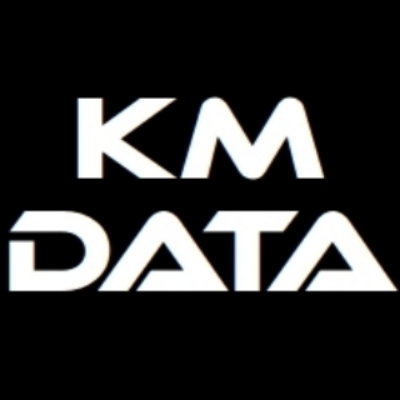

# Systemutveckling
Systemutveckling av specialprogram för tillverkningsindustri, främst fönster och dörr produktion.
Order/offert program, följesedel och fakturering, produktionsplanering, lagerstyrning och inköp mm.
Speciallösningar för order- och produktionsplanering, externa kopplingar mellan olika program och CNC-maskiner.
Låt era små tidskrävande administrativa uppgifter förenklas med små enkla program.
Genom att förenkla era arbetsuppgifter skapar ni tid till viktigare uppgifter. Det ska vara lätt att göra rätt.
[ERP-specialist](https://rightpeoplegroup.com/sv/erp-expert) och [BI-konsult](https://kugghuset.se/vad-ar-en-bi-konsult) (ansvarar för att integrera data från olika källor och skapa datamodeller för att organisera och strukturera data på ett meningsfullt sätt)

Jag har möjlighet att hjälpa er på distans.

[TeamViewer](https://get.teamviewer.com/kmdata) Fjärrstyrd support

[Jitsi Meet](https://meet.jit.si/) Digital möten med hög kvalitet

[Proton Meet](https://proton.me/meet) Digital möten med hög säkerhet, kommer snart.

### Kompetensområde
- [Winplan](https://www.dbmanager.fi/sv/ratkaisut/winplan/) (ERP-system för fönster och dörrfabriker)
- [RA Workshop](https://www.raworkshop.com/) (ERP-system för fönster och dörrfabriker)
- [MS Access](https://products.office.com/sv-se/access?rtc=1) (Microsoft databas hantering)
- [MS SQL](https://www.microsoft.com/sv-se/sql-server/sql-server-2019) (Databas server, SQL Server optimering)
- [Visual Studio](https://visualstudio.microsoft.com/) (Programmering)
- [Qt Creator](https://www.qt.io/development/tools/qt-creator-ide) (Programmering)
- [Windows](https://www.microsoft.com/sv-se/windows?r=1) (Operativsystem för server och arbetsstation)
- [Linux](https://distrowatch.com/) (Operativsystem för server och arbetsstation)
- Databashantering för produktion

### Nyheter & historik
- 1998-03-28  - Påbörjade min anställning hos H-Fönstret i Lysekil AB
- 2014-04-04  - Avslutade anställning hos [H-Fönstret i Lysekil AB](https://www.hfonstret.se/), startade KM-Data Haverud.
- 2018-10-02  - Informations träff [Maximalfönster](https://maximalfonster.se/) på plats i Åshammar.
- 2019-11-26  - Första informationsmötet om winplan hos [Odenfönster](https://odenfonster.se/) på plats i Falköping.
- 2023-03-23  - KM-Data är nu återförsäljare av fönstersystemet [RA Workshop](https://www.raworkshop.com/). Vilken [variant](doc/assets/RA Jämför.pdf) passar er bäst?
- 2024-01-09  - Presentation och informationsmötet hos [Wimmerby Fönstersnickeri](https://wimmerby.se/), på plats i Vimmerby.
- 2024-04-04  - 10 års jubileum.🎉
- 2024-11-01  - Informationsmötet om winplan via MS-Teams med [Snidex](https://www.snidex.se/).
- 2026

  

### Låt mig hjälpa er.

- Magnus Andersson
- [magnus@km-data.se](magnus@km-data.se)
- Mobil nr: 0709-621423

- [LinkedIn KM-Data](https://www.linkedin.com/company/lysapp/?viewAsMember=true)
- [LinkedIn Magnus](https://www.linkedin.com/in/magnusandersson4/)

# [ERP-System](https://km-data.github.io/erp.github.io/)

